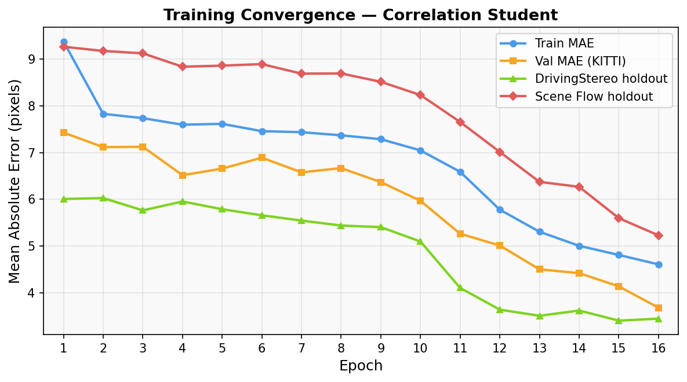
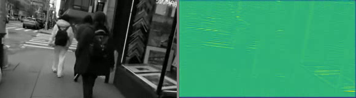
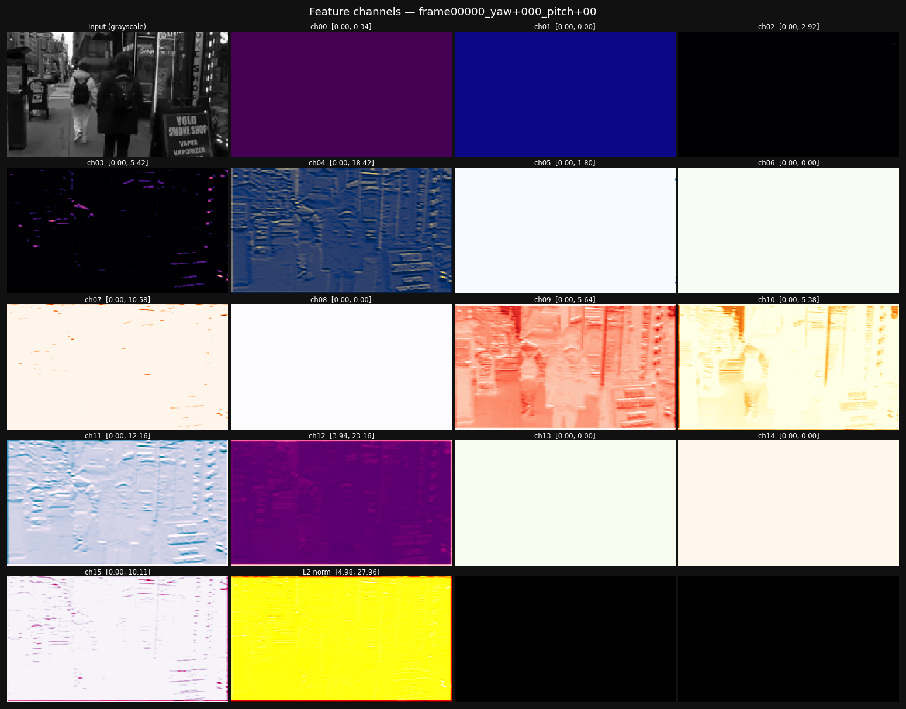
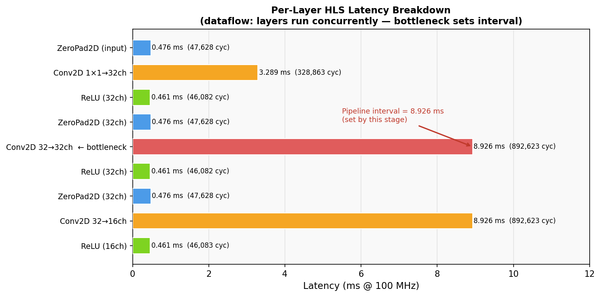
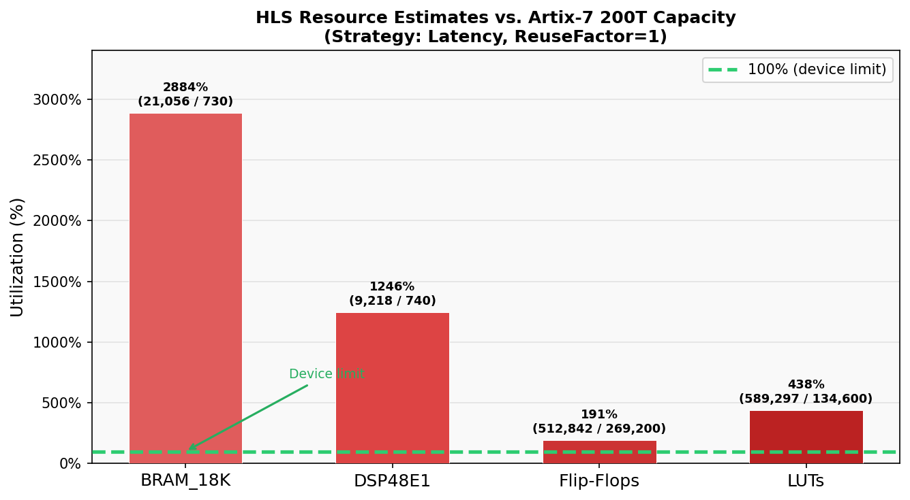
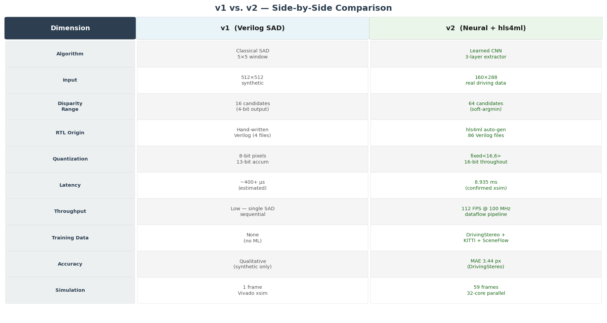

<!-- _class: lead -->

# Stereo Depth Estimation on FPGA

### From Hand-Written RTL to Neural HLS — v1 → v2

**PHYS 476 Final Project**
May 2026

---

## Project Goal

> **Real-time per-pixel depth estimation from a stereo camera pair, running on a Xilinx Artix-7 200T FPGA**

<br>

Two generations of the same pipeline:

| | v1 | v2 |
|---|---|---|
| **Approach** | Classical algorithm (SAD) | Trained neural network |
| **RTL** | Hand-written Verilog | Auto-generated via hls4ml |
| **Data** | Synthetic test image | 3 real-world driving datasets |
| **Simulation** | 1 frame | 59 frames, 32-core parallel |

---

## What is Stereo Depth?

<div class="columns">
<div>

Two cameras separated horizontally → same object appears at different **horizontal positions** in each image

**Disparity** = how many pixels the object shifted between left and right views

$$\text{depth} \propto \frac{1}{\text{disparity}}$$

</div>
<div>

```
Left image:    Right image:
  ■               ■
  ↑ x=200         ↑ x=185
  
  disparity = 15 px
```

> The task: for every pixel, predict disparity → depth map

</div>
</div>

---

## v1: Hand-Written Verilog SAD Matcher

<!-- _image: suggest including v1/output/depth_map.png here (the 2×2 panel: left/right/GT/output) -->

<div class="columns">
<div>

**Algorithm**: Sum of Absolute Differences (SAD)

1. Buffer last 5 rows per eye → 5×5 sliding window patches
2. Compare left patch against **16 shifted** right patches
3. Pick the shift with lowest SAD → disparity

**All hand-written Verilog** — 4 modules, ~600 lines

</div>
<div>

| Module | Role |
|---|---|
| `line_buffer.v` | BRAM circular buffer |
| `sliding_window.v` | 5×5 patch assembler |
| `sad_unit.v` | 25-cycle accumulator |
| `stereo_top.v` | FSM + top-level |

**Input**: 512×512 synthetic interleaved stream  
**Output**: 4-bit disparity per pixel

</div>
</div>

---

## v1: Design Challenges We Solved

<br>

**Problem 1 — LUT overrun** (92,630 required, 63,400 available)
- Initial design: 16 parallel SAD units with 25-input adder trees = too many LUTs
- **Fix**: One time-multiplexed SAD unit driven by a 4-state FSM → 20× LUT reduction

**Problem 2 — Synthesis error: non-constant part-select bounds**
```verilog
// ILLEGAL — 'r' is a runtime integer
col_in[(r+1)*DATA_WIDTH-1 : r*DATA_WIDTH]
// FIXED — genvar resolved at elaboration time
wire [DATA_WIDTH-1:0] col_pixel;
assign col_pixel = col_in[(gr_sh+1)*DATA_WIDTH-1 : gr_sh*DATA_WIDTH];
```

**Problem 3 — Mod-5 bank wrap synthesises a divider**
- `% 5` → ~9 LUTs; padded to 8 banks → simple comparator wrap

---

## Problems with v1

| Problem | What it means | Impact |
|---|---|---|
| **Slow on a single frame** | Single SAD unit: 25 cycles/pixel × 16 disparities × 512×512 pixels | ~68M cycles/frame — not real-time capable |
| **Very low resolution disparity** | 4-bit output = only 16 possible depth values | Blocky depth maps; poor precision for nearby objects |
| **Sliding window slows things further** | 5-row line buffer: can't begin until row 5 is buffered; each pixel waits on BRAM writes | Adds pipeline latency on top of sequential SAD |
| **Complex code for a simple idea** | 4 modules, 600+ lines of Verilog to implement: _compare patch A vs. shifted copies of patch B_ | Hard to extend, retune, or port to new resolutions |
| **No generalization** | Tested on one synthetic shifted image only | Breaks on real images: lighting variation, occlusions, texture-less regions |
| **Fixed algorithm** | SAD window size (5×5) and disparity range (16) are hardcoded | Cannot improve with more data or adapt to new scenes |

<br>

> **The question**: can we replace the matching core with a neural network — getting **faster predictions, better depth resolution, simpler code, and real-image generalization** on the same hardware?

---

## v2: System Architecture Overview

```
┌──────────────────────────────────┐
│  Shared Feature Extractor (FPGA) │   ← this is what we built in RTL
│                                  │
│  Conv2D(32) → Conv2D(32)         │
│  → Conv2D(16) [all fixed<16,6>]  │
│                                  │
│  (160×288×1) → (160×288×16)      │
└──────────┬───────────────────────┘
           │  256-bit AXI-Stream out (16 channels × 16 bits)
           ▼
┌──────────────────────────────────┐
│  Disparity Matcher (Python only) │   ← this is done in python
│  Correlation cost volume (d=64)  │
│  Soft-argmin regression head     │
│  → disparity map (H×W×1)         │
└──────────────────────────────────┘
```

> The **feature extractor** is the hardware-validated component.
> The disparity head runs in Python and produces the final depth map.

---

## v2 Model: Full Architecture

<div class="columns">
<div>

### Shared Feature Extractor
_(same weights for left + right)_

```
input (H, W, 1)
  ↓ Conv2D(32, 3×3, relu)
  ↓ Conv2D(32, 3×3, relu)
  ↓ Conv2D(16, 3×3, relu)
output (H, W, 16)
```

### Correlation Cost Volume
For d ∈ [0, 64):
```
shift right_feat by d pixels
→ dot product with left_feat
→ (H, W, 64) cost volume
```

</div>
<div>

### Disparity Regression Head

```
cost_volume (H, W, 64)
  ↓ Conv2D(64, 3×3, relu)
  ↓ Conv2D(32, 3×3, relu)
  ↓ Conv2D(64, 1×1)
  ↓ Softmax
  ↓ Σ d · P(d)   ← soft-argmin
output: disparity (H, W, 1)
```

**Loss**: masked Huber (smooth-L1)
over valid GT pixels only

**Input**: 160×288 @ 16:9 crop

</div>
</div>

---

## What is the Correlation Cost Volume?

It is the **neural network version of what SAD was doing in v1** — but instead of comparing raw pixels, it compares learned feature vectors.

<div class="columns">
<div>

**v1 (SAD)**: at each pixel position, take a 5×5 raw-pixel patch from the left image and compare it against 16 horizontally-shifted patches from the right image using L1 difference.

```
for d in 0..15:
  cost[d] = Σ |left_patch - right_patch_shifted_by_d|
```

**Winner** = smallest cost → best-guess disparity

</div>
<div>

**v2 (Correlation)**: same idea, but compare 16-dimensional _learned feature vectors_ instead of raw pixels. For each disparity offset `d`:

```
for d in 0..63:
  right_feat_shifted = shift(right_feat, d)
  cost[d] = dot(left_feat, right_feat_shifted)
            averaged over the 16 channels
```

**Result**: a `(H, W, 64)` score cube — one score per pixel per disparity

</div>
</div>

> **Why is this better?** Raw pixel patches fail on texture-less regions and lighting changes. Learned features can encode "this looks like a road surface" or "this is an edge" — making the matching much more robust even without an explicit patch window.

The regression head then takes the 64 scores at each pixel and produces a **single soft disparity estimate** via a weighted average (soft-argmin), giving sub-pixel precision instead of v1's 4-bit integer.

---

## Dataset Construction

<!-- _image: suggest a mosaic of 3–4 example stereo pairs from DrivingStereo/KITTI here -->

<div class="columns">
<div>

### Training Mix

| Dataset | Fraction | Pairs |
|---|---|---|
| **DrivingStereo** | 55% | ~170K |
| **Scene Flow (Monkaa)** | 25% | synthetic |
| **KITTI 2012+2015** | 20% | ~400 |
| mini_kitti (HF) | — | 88 (val) |

32,768 examples/epoch via chunk-streaming, 12 parallel workers

</div>
<div>

### Stereo-Safe Augmentation

- **Same random crop** on left + right → preserves horizontal alignment
- **No horizontal flip** → would invert disparities
- **Joint color jitter** → same params for both views
- **Resize** to 160×288 (16:9)
- **Normalize** to [0, 1]

</div>
</div>

---

## Training Results



---

## Training Results — Final Metrics

<br>

| Metric | Value |
|---|---|
| **Val MAE** (88 KITTI pairs) | **3.68 px** |
| **DrivingStereo holdout MAE** (1,024 pairs) | **3.44 px** |
| DrivingStereo holdout RMSE | 4.56 px |
| Bad-1px rate | 71.5% |
| Bad-3px rate | 35.4% |
| Bad-5px rate | 19.4% |
| Scene Flow holdout MAE | 5.23 px |

<br>

> Scene Flow MAE is higher (5.23 vs 3.44 px) — expected domain gap: the model is primarily tuned to real-world appearance statistics from DrivingStereo + KITTI

---

## hls4ml Conversion Pipeline

<br>

```
feature_extractor.keras  (160×288×1 → 160×288×16, float32)
         │
         │  hls4ml.convert_from_keras(config)
         │  ┌─────────────────────────────────────────────────────┐
         │  │  Quantization:  fixed<16,6>  (16-bit, ±32, 1/1024) │
         │  │  IO type:       io_stream  (AXI-Stream everywhere)  │
         │  │  Strategy:      Latency                             │
         │  │  ReuseFactor:   1  (full parallel, no time-mux)     │
         │  └─────────────────────────────────────────────────────┘
         │
         ▼
  Vitis HLS 2025.2   (build_prj.tcl)
  C synthesis → 86 Verilog files, 397K lines
  Target: xc7a200tfbg484-1, 100 MHz
```

### Why `fixed<16,6>`?

Range: ±31.98 &nbsp;|&nbsp; Precision: 1/1024 ≈ 0.001 &nbsp;|&nbsp; Sufficient for 3-layer convolution depth

---

## RTL Interface (AXI-Stream)

<br>

```
                  ┌──────────────────────────────────────┐
                  │        myproject (HLS IP)            │
                  │                                      │
 image_r_TDATA    │  16 bits  ←  one pixel per beat      │
 image_r_TVALID ──│──────────────────────────────────────│──
 image_r_TREADY   │                                      │
                  │  46,080 input beats per frame        │
                  │  (160×288 pixels)                    │
                  │                                      │
 layer7_out_TDATA │  256 bits →  16 channels per beat    │
 layer7_out_TVALID│──────────────────────────────────────│──
                  │  ch0=bits[15:0], ch15=bits[255:240]  │
                  │  46,080 output beats per frame       │
                  └──────────────────────────────────────┘
```

One **16-bit fixed-point pixel** in → one **256-bit word** (16 feature channels) out, per spatial location

---

## Vivado Simulation Infrastructure

<div class="columns">
<div>

### What we built
- **`myproject_tb.sv`** — SystemVerilog testbench
  - AXI-Stream driver + output capture
  - Writes `.hex` (raw) + `.f32` (decoded) per frame
  - 46,080 beats captured before done

- **`vivado_sim.tcl`** — batch project setup
  - Adds all 86 RTL files + testbench
  - Behavioral sim only (no synthesis/bitstream)

- **`run_parallel_xsim.sh`** — parallel runner
  - Compile once, reuse snapshot via symlinks
  - `xargs -P 32` across 59 frames

</div>
<div>

### Key bug: `ap_done` timing

```systemverilog
// BROKEN — misses 1-cycle pulse
@(posedge ap_done);

// FIXED — done when all beats captured
integer beat_count;
...
while (beat_count < N_PIX)
    @(posedge clk);
```

### Center-crop (512×512 → 160×288)
Inline Python in the shell runner crops before staging each `.mem` file:
```python
rows[176:336, 112:400]  # = 160×288
```

</div>
</div>

---

## Simulation Results

<div class="columns">
<div>

### Timing validation

From simulation log:
```
INFO [8982675000] All 46080 output beats captured
INFO [8982875000] Frame complete
```

| | Value |
|---|---|
| xsim measured | 8.983 ms |
| HLS predicted | 8.935 ms |
| Match | **0.5%** ✓ |

### 59-frame parallel run
- Wall time: **~84 min** on 32 cores
- ~17–30 min per frame
- Simulator runs at **~170,000×** slower than real silicon

</div>
<div>

### Feature heatmap video still



_Left: grayscale input — Right: L2 norm of 16-channel feature output_

</div>
</div>

---

## Feature Map: All 16 Channels (Frame 0)



---

## Feature Map: Channel Analysis

<br>

| Channel(s) | Behavior | Interpretation |
|---|---|---|
| 4 | Strong edges (range 0–18.4) | Vertical edge detector |
| 9, 10 | High-frequency texture | Sign/detail responder |
| 11, 12 | High activation everywhere (floor >3.9) | Learned DC bias / global feature |
| 0, 1, 2, 5, 6, 8, 13, 14 | **All zero** | ReLU-saturated / dead |
| L2 norm | 4.7 – 31.3 | Real spatial structure, high at edges/texture |

<br>

> 8 of 16 channels are dead (ReLU saturation) — common in small CNNs. The active channels show clear edge and texture responses consistent with learned stereo features.

---

## FPGA Performance Estimates

<br>

| Metric | Value |
|---|---|
| Target clock | 10.00 ns (100 MHz) |
| HLS estimated critical path | 7.27 ns |
| **Estimated Fmax** | **137.5 MHz** |
| **Latency per frame** | **893,498 cycles = 8.935 ms** |
| **Throughput (dataflow interval)** | 892,620 cycles → **112 FPS @ 100 MHz** |
| Throughput @ estimated Fmax | **154 FPS @ 137.5 MHz** |
| Real-time threshold (30 FPS standard) | interval < 33.3 ms/frame |
| **Margin vs. real-time** | **3.7× faster than needed** |

<br>

> **Latency vs. throughput**: _latency_ (8.935 ms) is the delay from first pixel in to last feature out for one frame. _Interval_ (8.926 ms) is how often the pipeline can accept a new frame — this sets throughput. With `dataflow` pipelining all three conv layers run concurrently, so a new frame enters every 8.926 ms even while the previous one is still completing. Real-time requires interval < 33.3 ms, not latency < 33.3 ms.

---

## Per-Layer Latency Breakdown



- **Conv2D 32→32 is the bottleneck** — 8.926 ms (892,623 cycles), 19× longer than the next largest layer
- **Conv2D 32→16 ties it** — same interval because with `dataflow`, both run concurrently; the slower one sets the pipeline rate
- **Conv2D 1→32** (3.289 ms) and all padding/ReLU layers (~0.46 ms) are fully hidden behind the bottleneck
- Optimizing Conv2D 32→32 (e.g., via ReuseFactor or channel reduction) would directly cut the 112 FPS figure

---

## Resource Utilization



- **BRAM is the worst overflow** — 2,884% (21,056 needed vs. 730 available): every conv layer buffers full feature maps in BRAM with RF=1
- **DSPs at 1,246%** — 9,218 needed vs. 740; driven by 32×32×9 = 9,216 multipliers in the bottleneck layer alone
- **LUTs at 438%** — 589K needed vs. 135K; routing and accumulation logic for all parallel MACs
- **Flip-flops closest to feasible at 191%** — pipeline registers are the least explosive resource; only ~2× over
- All four resources overflow — this is not a marginal miss; fitting on Artix-7 requires fundamentally reducing parallelism

---

## Why the Design Overflows the Artix-7

**Core problem**: `ReuseFactor=1` instantiates one DSP per multiply — no time-multiplexing

For Conv2D layer 2 (32→32 channels, 3×3 filter):

$$\text{DSPs needed} = C_{in} \times C_{out} \times 9 = 32 \times 32 \times 9 = \mathbf{9{,}216}$$

The Artix-7 200T has **740 DSPs total**.

<br>

### Paths to fit on Artix-7

| Approach | DSP budget | Latency penalty |
|---|---|---|
| `ReuseFactor = 64` | ~144 DSPs ✓ | ~64× longer per layer |
| Reduce to 8 feature channels | ~1,025 DSPs | Accuracy loss |
| Use Kintex/Ultrascale+ device | fits at RF~1 | Minimal |
| 8-bit quantization (`fixed<8,4>`) | ~2× improvement | Some accuracy loss |

---

## v1 vs. v2 Comparison



---

## Development Flow Summary

```
Raw stereo data (DrivingStereo, KITTI, Scene Flow)
  ↓  train_stereo.py — 16 epochs, batch 128, Adam 3e-4
correlation_student.keras  (MAE 3.44 px on DrivingStereo)
  ↓  convert_student.py — extract feat_conv1→conv3
feature_extractor.keras  (160×288×1 → 160×288×16)
  ↓  hls4ml + Vitis HLS 2025.2
86 Verilog files, 397K lines  (fixed<16,6>, io_stream, RF=1)
  ↓  vivado_sim.tcl — behavioral sim only
Compiled xsim snapshot  (xc7a200tfbg484-1)
  ↓  run_parallel_xsim.sh — 32 cores, 59 frames
rtl_output_*.f32  (46,080 × 16 float32 per frame)
  ↓  render_feature_video.py / render_channel_grid.py
feature_video_10fps.mp4  +  channel_grid_frame0.png
```

---

## What Is and Isn't in Hardware

<br>

| Component | Status |
|---|---|
| ✅ Trained stereo depth model (Python) | **Complete** — runs end-to-end, produces depth maps |
| ✅ Feature extractor RTL (hls4ml) | **Complete** — 86 Verilog files synthesised |
| ✅ Behavioral simulation (xsim) | **Complete** — 59 frames validated |
| ✅ HLS performance/resource report | **Complete** — latency 8.935 ms, 112 FPS |
| ⬜ Disparity correlator in RTL | **Not built** — currently Python-only |
| ⬜ Vivado synthesis + implementation | **Not done** — no place-and-route |
| ⬜ Resource-reduced variant (RF≥64) | **Not done** — design overflows Artix-7 |
| ⬜ Physical bitstream / board test | **Not done** |

---

## Conclusions

<br>

1. **v1 → v2** demonstrates the shift from classical hand-coded RTL to ML-driven HLS generation — reducing 600 lines of careful Verilog to a Keras model + config file

2. **hls4ml closes the gap** between Keras and synthesizable RTL: 86 auto-generated Verilog files passed behavioral simulation with 0.5% timing accuracy vs. HLS report

3. **112 FPS at 100 MHz** for the feature extractor — 3.7× headroom over real-time 30fps, *when run on a device large enough*

4. **The Artix-7 is too small** at full parallelism — 12.5× DSP overflow. ReuseFactor tuning or a larger device is the critical next step

5. **8 of 16 feature channels are dead** (ReLU saturation) — suggests the network is over-parameterized for this task; fewer channels + fewer dead neurons would both fit better on FPGA and likely not hurt accuracy

---

## Next Steps

<br>

**Fit on Artix-7 (immediate)**
- Generate `ReuseFactor=64` resource-strategy variant → target <700 DSPs

**Complete the hardware pipeline**
- Implement WTA (winner-takes-all) correlator in Verilog to consume 256-bit feature stream → disparity

**Validate numerics**
- Run `decode_vivado_output.py --hex-file ... --model ...` to confirm fixed-point error vs. float reference

**Deploy**
- Post-implementation timing closure → bitstream → ILA on-board measurement

---

<!-- _class: lead -->

# Thank You

**Simulation artifacts**:
- `v2/hls4ml/outputs/feature_video_10fps.mp4` — 59-frame feature heatmap
- `v2/hls4ml/outputs/channel_grid_frame0.png` — all 16 output channels
- `REPORT_v2.md` — full technical writeup

**Tools**: Keras 3 · PyTorch backend · hls4ml · Vitis HLS 2025.2 · Vivado 2025.2 · xsim
